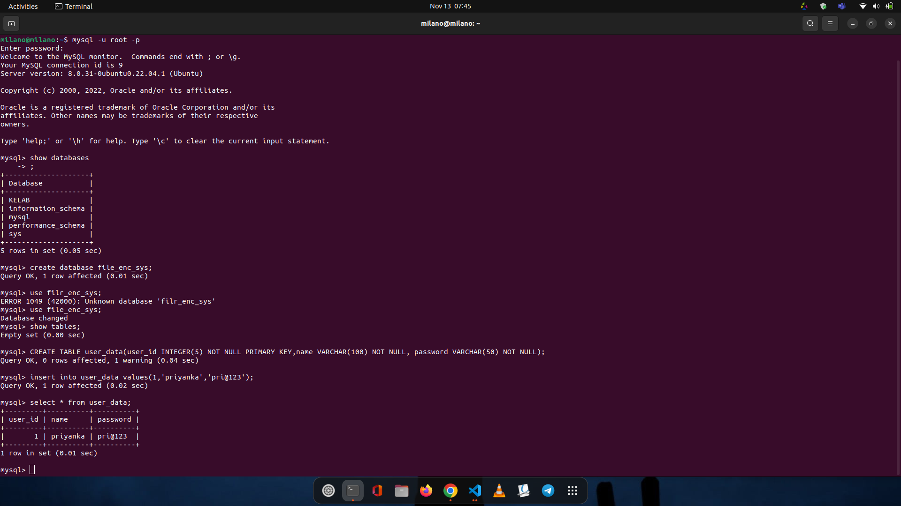
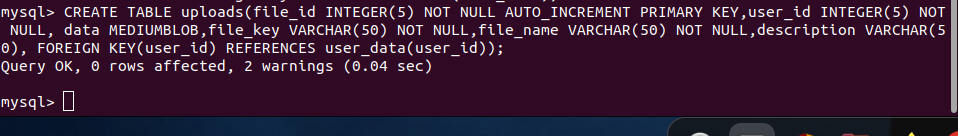

# SCHEMA CREATION





> https://www.javaguides.net/2019/07/login-application-using-java-swing-jdbc-mysql-example-tutorial.html //FOR LOGIN (done, UI Update only)

https://www.javaguides.net/2019/07/registration-form-using-java-swing-jdbc-mysql-example-tutorial.html //FOR REGISTRATION(not done)

https://www.codersarts.com/post/register-and-login-form-with-java-swing

//FILE INPUT

https://www.geeksforgeeks.org/java-swing-jfilechooser/#:~:text=The%20java%20Swing%20package%20is,a%20file%20or%20a%20directory%20.

https://www.codejava.net/java-se/jdbc/insert-file-data-into-mysql-database-using-jdbc //FILE DATA INSERT

https://www.baeldung.com/java-create-file-in-directory

// used for table https://www.c-sharpcorner.com/UploadFile/fd0172/display-records-from-database-using-jtable-in-java/

// file https://www.geeksforgeeks.org/java-swing-jfilechooser/

//to ENC : https://stackoverflow.com/questions/27962116/simplest-way-to-encrypt-a-text-file-in-java


// append to file


```
File file = new File("append.txt");
FileWriter fr = new FileWriter(file, true);
fr.write("data");
fr.close();
```
